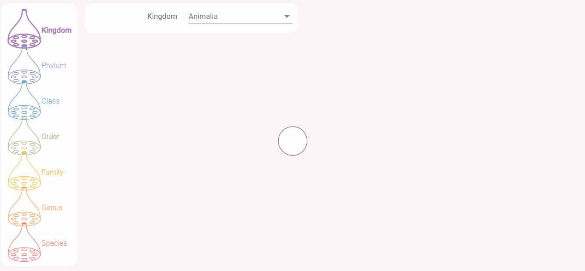

# Taxon

Taxonomy representation using a mixt of **[Angular][angularLink]** and **[D3.js][d3Link]**.

Accessible at **[hugomencoboni.github.io/taxon/][deployedWebSite]**, you can navigate in a taxonomic tree.

## Sources

The current application uses **[the GBIF API][bgifAPILink]**.

[deployedWebSite]: https://hugomencoboni.github.io/taxonVisualization/
[angularLink]: https://angular.io/
[d3Link]: https://d3js.org/
[bgifAPILink]: https://www.gbif.org/fr/developer/summary
